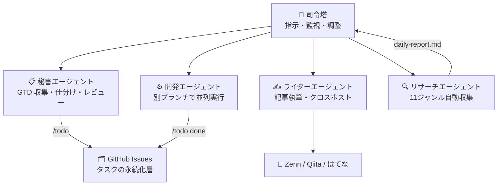

[Claude Code](https://docs.anthropic.com/en/docs/claude-code/overview) を導入して6日が経ちました。

「AIコーディングツール」として紹介されることが多い Claude Code ですが、6日間使い込んでみた結果、コードを書くだけのツールではなくなりました。タスク管理、情報収集、記事執筆、健康管理――気づけば**自分専属のチーム**ができていました。

この記事では、Day 1 から Day 6 で実際に何を作り、何が変わったかを時系列で振り返ります。なお、この記事自体もライターエージェントとのチャットで作成し、別のエージェントがレビューしています。私はエディタを一度も開いていません。

## 6日間の全体像

まず数字で振り返ります。

| 指標 | 結果 |
|------|------|
| 開発したアプリ | 2個（ラーメンレビューアプリ、銀行システム） |
| 開発したスキル | 2個（/todo GTD、/health 健康管理） |
| テストケース | 303件（/todo） + 676行（銀行アプリ） |
| 公開した記事 | 2本公開 + 4本予約公開 |
| 自動化フロー | 2つ（デイリーリサーチ、クロスポスト） |
| エージェント構成 | 3層（ハブ + 秘書 + ライター） |

最終的にできた全体構成はこうなっています。中央の司令塔（複数の Claude Code インスタンスを束ねる役割）から、それぞれ専門の役割を持つエージェントが動いています。



ただし、最初からこの構成を狙っていたわけではありません。Day 1 のアプリ開発で受けた衝撃が、この構成に至るきっかけでした。

## Day 1 ── ラーメンアプリ開発と最初の衝撃

### 環境構築が全部自動で終わった

Claude Code で最初にやったのは、近くのラーメン屋を検索・レビューできる Web アプリの開発でした。Python / FastAPI / Google Maps API という構成です。

驚いたのは**環境構築**です。SE として日々やっている仕事そのもの――依存関係のインストール、ディレクトリ構成の作成、設定ファイルの配置――これが全部 Claude Code のチャットだけで終わりました。自分がやったのは API トークンの取得くらいです。

### コーディングもテストもチャットで

環境ができたあとのアプリ開発も同じでした。

- 「ラーメン屋を距離順でソートする機能がほしい」→ 実装される
- 「Google Maps へのリンクもつけて」→ 追加される
- 「CSS を HTML から分離して」→ リファクタリングされる

コーディング、テスト、コードレビュー、セキュリティ対策。全部チャットで指示を出すだけで開発が進んでいく。1日で 8 コミット、機能追加からリファクタリングまで完了しました。

完成したアプリで近所のラーメン屋を検索してみたら、食べたいラーメンを探すだけで時間が溶けていきました。自分が作ったアプリで遊ぶのは格別です。

あまりの衝撃に、その日のうちに Mac mini を発注してしまいました。納期はまだ先なので、今は手元のメモリ 8GB の Windows で作業していますが、十分動くのは嬉しい誤算。Mac が届くのが待ち遠しいです。

## Day 2 ── 銀行アプリ開発、そして気づき

### Java の本格的な開発環境も自動構築

Day 1 の体験に手応えを感じ、次は Java で銀行システムのサンプルアプリを作りました。今度は本格的な環境です。

- Java 21（Temurin）
- WildFly 32（アプリケーションサーバー）
- PostgreSQL 17（データベース）
- Docker / docker-compose（コンテナ化）
- Maven（ビルド）

Java 21 + WildFly + PostgreSQL + Docker という構成を伝えたら、インストールと接続設定を **Claude Code が全部やってくれました**。自分がやったのはパスワードの設定だけ。マルチステージビルドの Dockerfile も、WildFly の設定スクリプトも、全部チャットから生まれています。

### テストとリファクタリングの威力を学んだ

このプロジェクトで大きかったのは、**テストを回してリファクタリングする**という体験です。JUnit 5 + Mockito で 676 行のテストコードが書かれ、安心してコードを変更できる。未使用 import の削除、不要なアノテーションの除去といったリファクタリングも、テストがあるから怖くない。

この学びは、後の /todo スキル開発（303件のテスト）に直接活きてきます。

### 「自分の作業を代替できる」と気づいた

2日間のアプリ開発で確信しました。Claude Code は単なるコード補完ツールではない。**環境構築、コーディング、テスト、レビュー、リファクタリング――SE が日々やっている作業の全工程を、チャットで指示するだけで回せる。**

ここで思いました。1つの Claude Code インスタンスでこれだけできるなら、**複数のインスタンスを組み合わせたらどうなるか**。秘書にタスク管理を任せ、開発エージェントにコーディングを任せ、ライターに記事を任せる。マルチエージェント環境を作ろう、と。

同日、司令塔の初期セットアップに着手しました。新しいフォルダで Claude Code を起動して、「あなたは司令塔です」と伝えただけです。Claude Code が自分で CLAUDE.md（プロジェクトの役割やルールを定義する設定ファイル）を作り、ディレクトリ構成を提案してくれました。

## Day 3 ── デイリーリサーチの仕組み化

マルチエージェントの最初の実験として、「毎日の情報収集を自動化したい」と伝えました。

まず Claude Code に MCP（Model Context Protocol = 外部サービスとの接続の仕組み）の設定をさせ、Slack への自動投稿を可能にしました。次に「自分の興味がある11ジャンル（AI、筋トレ、ウィスキー、ラーメン、Swift、金融など）の最新情報を集めてレポートにまとめて」と伝えたら、69 行の指示書を Claude Code が自分で書き上げてくれました。

同日中に初回レポートが生成されました。AI 業界のニュース分析、筋トレの最新研究、ウィスキーの値上げ情報――各ジャンルの注目トピックと要約がまとまっています。

「天気予報もほしい」と伝えたら即座に追加。「前日のアクション振り返りも入れて」と言ったら、それも翌日から反映されました。「動かす → 差分を伝える → 改善される」、**このサイクルが速い**のが Claude Code の強みです。

専属リサーチャーが、月額プランの範囲内で毎日動いている。

## Day 4 ── /todo GTD スキル開発

Claude Code の中でタスク管理を完結させたくなり、「GTD（Getting Things Done = タスク管理手法）のスラッシュコマンドを作りたい」と伝えました。スラッシュコマンドは Claude Code に独自の機能を追加するカスタムスキルのことで、`/todo` と打つだけで呼び出せます。

GitHub Issues をバックエンドに使い、GTD の6カテゴリ（inbox / next / waiting / someday / project / reference）でタスクを管理する `/todo` コマンドが生まれました。

```bash
/todo next 設計書を書く @PC --due 明日
/todo waiting 見積もり回答待ち @上司
/todo done 5
```

Day 2 の銀行アプリで学んだ「テストを先に書いてリファクタリングを恐れない」パターンが活きました。この日のうちにテスト基盤の構築、バグ修正、優先度機能、rename / untag / recur コマンドまで進みました。

> 📖 詳しくはこちら: [Claude Code で GTD を回す /todo スラッシュコマンドを作った](https://zenn.dev/tottoko_hamu/articles/claude-code-todo-gtd)

## Day 5 ── すべてが爆発した日

この日が密度のピークでした。朝から夜まで、ほぼ途切れることなくエージェントが動き続けました。途中で Pro プラン（月額 $20）の制限に引っかかり、作業が止まるのがどうしても嫌で、その場で Max プラン（月額 $100）にアップグレードしました。それくらい手が止められなかった。

### /todo が一気に進化した

「もっと便利にしたい」という要望を次々伝えていったら、1日で以下が実現しました。

- ダッシュボードでタスク全体を俯瞰できるように
- 朝の計画と夕方の振り返りを対話で回せるデイリーレビュー機能
- 複合条件でタスクを絞り込むカスタムビュー
- 週次・月次の実績をまとめるレポート出力

コードが 2,011 行まで膨れていたので「重複を探して整理して」と頼んだら、エンジン部分を別ファイルに抽出して 838 行まで削減（58%カット）。API 呼び出しも 8回→1回に統合され、体感速度が大幅に改善しました。テストが 303 件あるので、これだけ大胆なリファクタリングも安心して任せられます。

さらに英語対応（i18n）とモバイル向けラベル絵文字化も同日に完了。

### Zenn セットアップ + 記事公開

**同日に** Zenn の初期セットアップ、クロスポストスクリプト（Zenn → Qiita → はてなブログに1コマンドで同時展開）の作成、そして記事の公開までやりました。

```bash
# 1コマンドで3サイトに展開
bash crosspost.sh claude-code-todo-gtd --publish --qiita --hatena
```

この日は本職の仕事をしながら、合間にエージェントへ指示を出し続けていました。エージェントが並列で動いている間にレビューし、戻ってきた成果物に次のフィードバックを投げる。一日中頭がフル回転で、アドレナリンが出まくって夜は眠れませんでした。

順調なだけではありません。i18n 対応のテスト中、テストスクリプトが `~/.claude/` を丸ごと消し飛ばす事故が起きました。テストは全パスしているのに、Claude Code のログイン情報が毎回消えている。原因は `HOME` 環境変数の差し替え方にありました。詳しくは別記事にまとめています。

> 📖 [テストが ~/.claude/ を消し飛ばした話 — HOME 差し替えの罠](https://zenn.dev/tottoko_hamu/articles/claude-todo-test-selfdestruct)

なぜこの量が1日で可能だったか。事故も含めて乗り越えられたのは、**Day 1-4 で作った仕組みが回り始めていたから**です。開発エージェントに「この機能を追加して」と指示書を渡せば並列で動く。ライターエージェントに「この内容で記事を書いて」と伝えれば下書きが出てくる。人間がやるのは最終チェックと「ここが違う」のフィードバックだけ。

:::message
Day 5 の教訓: 「仕組みを先に作る」の効果は、量産フェーズで一気に現れる。Day 1-4 の地味な基盤整備がなければ、この日の密度は実現できなかった。
:::

## Day 6 と、これから

最終日は「コーディング以外にも使えるのでは」と思い、健康管理スキル `/health` を作りました。体重・体脂肪・運動記録を GitHub Issues に保存するもので、/todo の構造を流用して 30 分で完成。リサーチエージェントには技術ブログの収益化戦略を調査させ、次のアクションが見えてきました。

6日間で作った仕組みはまだ成長中です。個別テーマの記事も準備しています。

## 6日間やってみて気づいたこと

### Claude Code は「コーディングツール」ではない

Day 1-2 のアプリ開発で「これはコーディングアシスタントではなく、人間の作業者の代替だ」と気づきました。環境構築、コーディング、テスト、レビュー、リファクタリング。SE の全工程がチャットで回る。

そこからさらに進んで、CLAUDE.md で役割を定義し、スキルで能力を拡張し、エージェントで並列実行するようになりました。秘書がタスクを管理し、開発者がコードを書き、ライターが記事を公開し、リサーチャーが情報を集める。**自分専属のチームを持った感覚**です。

### 「仕組みを作る仕組み」が一番強い

個別の成果物（アプリや /todo や記事）ではなく、**それらを生み出す構造**を先に作ったことが加速の鍵でした。

- エージェント構成（3層分離）→ 並列作業が可能に。さらに各エージェントが専門領域の知識を蓄積するので精度も上がる
  - 例: ライターエージェントは文体ルールを覚えているので、2本目以降はトーンの指示が不要になった
- テスト基盤（Day 2 の銀行アプリで学習）→ リファクタを恐れずに済む
- 記事パイプライン → 書く→公開のコストが激減
- デイリーリサーチ → 情報収集が自動化

Day 5 の爆発的な生産性は、Day 1-4 の基盤整備の副産物です。

### 書く人とチェックする人を分けられる

この記事の作成でも実感しましたが、別のエージェントにレビューを依頼すると、用語説明の不足や Markdown 記法の表示崩れなど、自分では気づかない問題点も指摘してくれます。書く人とチェックする人を分けられるのも、マルチエージェントの強みです。PC を操作しているのは私一人ですが、チームで作業しているという実感が湧きます。

この記事が6日間の出来事を時系列で正確に書けているのも、Claude Code のメモリ（会話をまたいで残る記憶）と日々の作業ログ、git のコミット履歴があるからです。「あのとき何をやったか」を人間が思い出す必要はなく、ライターエージェントがログと履歴を辿って事実を拾い上げてくれます。

### 始めるなら「役割を伝える」ところから

Claude Code を入れたら、新しいフォルダで起動して「あなたは○○です」と伝えてみてください。CLAUDE.md の書き方を調べる必要はありません。Claude Code が自分で作ります。

```markdown
# 最初の一歩: こう伝えるだけ
「あなたは○○プロジェクトの開発アシスタントです。
 このフォルダで○○を管理してください。」
```

動かしてみて、違ったら「ここが違う」と伝える。それだけで環境が育っていきます。

## 関連記事

### /todo GTD シリーズ

- [Claude Code で GTD を回す /todo スラッシュコマンドを作った](https://zenn.dev/tottoko_hamu/articles/claude-code-todo-gtd)
- [Claude Code GTDスキルにPro機能を実装した話](https://zenn.dev/tottoko_hamu/articles/claude-todo-gtd-pro-features)
- [/todo を英語対応した話](https://zenn.dev/tottoko_hamu/articles/claude-todo-gtd-i18n)
- [テストが ~/.claude/ を消し飛ばした話](https://zenn.dev/tottoko_hamu/articles/claude-todo-test-selfdestruct)
- [エージェントに /todo を持たせたら GTD が自動で回った話](https://zenn.dev/tottoko_hamu/articles/claude-todo-agent-gtd)
- [朝10分の GTD ルーティン](https://zenn.dev/tottoko_hamu/articles/claude-todo-morning-gtd)

### 個別テーマ（準備中）

- 毎朝のデイリーリサーチを全自動化した話 ── 11ジャンルの情報が毎朝 Slack に届く仕組み
- カスタムスキル入門 ── /health を30分で作った話。スキルファイルの構造から解説
- Zenn → Qiita → はてな 三面展開クロスポスト ── 1コマンドで3サイト同時投稿

この記事の6日間をさらに深掘りした一冊があります。

[コードを書けない私がClaude Codeで「AIチーム」を作るまで（Zenn Books）](https://zenn.dev/tottoko_hamu/books/leading-ai-agents-without-code)

続編が気になる方は [Zenn でフォロー](https://zenn.dev/tottoko_hamu) していただけると通知が届きます。
