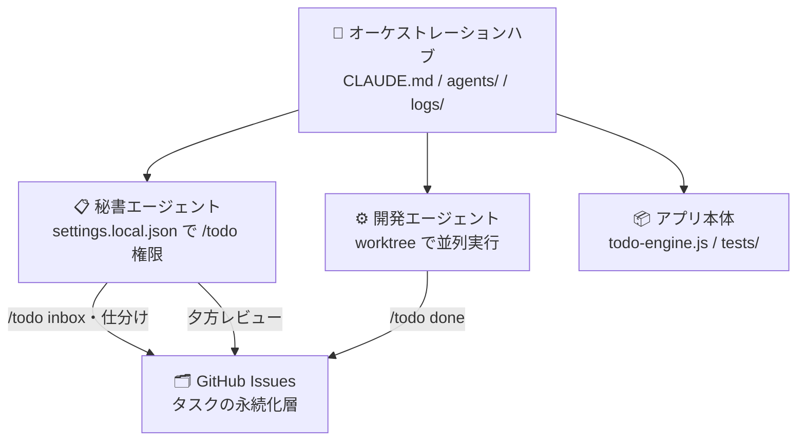
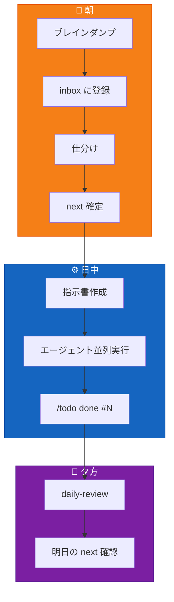

## 要約

- Claude Code の秘書エージェントに GTD のブレインダンプ→仕分けを任せた
- 開発タスクは指示書を書いてエージェントに並列実行させた
- 人間がやったのは「朝の質問に答えること」と「指示書を書くこと」だけ
- 結果: 記事3本 + i18n実装 + モバイル対応 + 363テスト全パスを1日で達成

## 🧠 GTD、やってますか？

「あれやらなきゃ」「あの件どうなったっけ」「そういえばあの返信...」

頭の中にタスクが住み着いていませんか。彼らは家賃を払わないくせに、脳のメモリを圧迫し、深夜に突然「忘れてたでしょ？」と起こしてきます。

GTD（Getting Things Done）は、この不法占拠者たちを全員追い出して外部システムに住まわせる方法論です。頭の中を空にして、信頼できるシステムに全部預ける。すると不思議なことに、「何かやり忘れてる気がする」という漠然とした不安が消えます。

問題は、GTD 自体の運用がめんどくさいこと。収集して、仕分けして、レビューして...真面目にやると毎日30分は溶けます。

**じゃあその運用、エージェントにやらせればいいのでは？**

## 💡 /todo を「人間が使う」から「エージェントに使わせる」へ

Claude Code 用の GTD タスク管理スラッシュコマンド `/todo` を作りました。

https://zenn.dev/tottoko_hamu/articles/claude-code-todo-gtd

ターミナルで `/todo next 設計書を書く --due 明日` と打つだけでタスク管理ができて便利。でも使い込んでいくうちに、ふと思いました。

**これ、自分で打たなくてもよくない？**

Claude Code にはエージェント（サブプロセス）を起動する機能があります。エージェントに `/todo` へのアクセス権を持たせたら、GTD の収集・仕分け・実行・レビューが最小限の介入で回り始めました。

今回はその1日の運用を記録します。

## 🏗️ 構成: オーケストレーションハブ + 秘書エージェント

全体像はこうです。Claude Code のプロジェクトを3層に分けています。



:::details ディレクトリ構成（テキスト版）
```
hub/                         ← オーケストレーションハブ
├── CLAUDE.md                ← 全体の指示・基本ルール
├── agents/                  ← エージェント指示書
│   ├── feat-i18n.md         ← 「英語対応して」の仕様書
│   └── fix-test.md          ← 「このバグ直して」の仕様書
├── logs/                    ← 作業ログ・記事下書き
├── secretary/               ← 秘書エージェント
│   ├── .claude/
│   │   └── settings.local.json  ← /todo アクセス権
│   └── agents/
│       ├── gtd-collect.md       ← GTD収集ワークフロー
│       └── trigger-list.md      ← ブレインダンプ用トリガー
└── app/                     ← アプリ本体の開発ディレクトリ
```
:::

ポイントは **秘書エージェントが独立したサブプロジェクト**になっていること。`settings.local.json` で `gh issue` コマンドの実行権限を持ち、`/todo` スキルにアクセスできます。オーケストレーションハブはこの秘書に「頭の中を整理して」と頼むだけ。

## 🔄 1日の流れ: 収集→実行→完了の循環

1日の流れを先に押さえておきます。



`/todo` の裏側は GitHub Issues なので、**どのエージェントからも同じタスクリストが見えます**。秘書がタスクを登録し、開発エージェントが完了マークを付け、夕方のレビューで進捗を確認する。人間がやるのは朝の質問に答えることと、指示書を書くことだけ。

ここからは、朝・日中・夕方それぞれの中身を詳しく見ていきます。

## 🌅 朝: 秘書にブレインダンプを任せる

朝イチで秘書エージェントに「GTD収集して」と伝えます。秘書は `gtd-collect.md` というワークフローに従って3つのフェーズで動きます。

**収集** — トリガーリストを使って頭の中を空にする

```
秘書: 「仕事関連で気になっていることは？ やりかけ、返信、報告、書類...」
自分: 「英語テストが1件落ちてる」「記事を3本書きたい」
秘書: → /todo inbox 英語テスト修正 @PC
       → /todo inbox 記事: i18n編 @PC
       → /todo inbox 記事: テスト自爆編 @PC
       → /todo inbox 記事: エージェント運用編 @PC
秘書: 「お金・手続き関連は？ 支払い、契約、税金...」
自分: 「特にない」
秘書: 「次、暮らし・家事...」
```

全8カテゴリのトリガーを順に聞いていく。「スマホの通知で放置しているものは？」「半年以上先延ばしにしていることは？」といった追加トリガーも用意してあり、詰まったときに出してくれます。

**仕分け** — inbox を1件ずつトリアージ

```
秘書: 「#42 英語テスト修正 → next / waiting / someday ?」
自分: 「next、優先度 p1 で」
秘書: → /todo move 42 next
       → /todo priority 42 p1
```

**整理** — next を10〜15件に絞る。2分ルールで即完了できるものはその場で片付ける提案もしてくれます。

これで朝の15分で inbox がゼロになり、今日やることが明確になります。自分がやるのは質問に答えるだけ。

:::message
😌 **この時点の気持ち**: 頭が空っぽになって気持ちいい。「あれどうしよう」が全部 GitHub Issues に引っ越した安心感。朝コーヒー飲みながらチャットしてただけなのに、なぜか仕事した気分になる。
:::

## ⚙️ 日中: 指示書を書いてエージェントに投げる

next に入ったタスクのうち、開発系のものは**指示書**にして別のエージェントに渡します。

例えば今日の i18n 対応。`agents/feat-i18n.md` にこんな指示書を書きました（抜粋）:

```markdown:agents/feat-i18n.md
# 指示書: 英語対応（i18n）

## 目的
環境変数 LANG_ENV で ja/en を切り替え

## 対象ファイル
| ファイル | 変更内容 |
|---------|---------|
| engine.js | メッセージ辞書 + t()/tpl()/cnt() |
| command.md | 言語検出セクション追加 |
| tests/run-tests.sh | 英語テスト53件追加 |

## 実装順序
Phase 1: 基盤（辞書追加のみ、既存コード変更なし）
Phase 2: エラーメッセージ置き換え（約16箇所）
Phase 3: 日付パーサーに英語パターン追加
Phase 4: 表示関数の多言語化
各Phase完了後に必ず全テスト実行すること。

## 検証方法
1. bash tests/run-tests.sh → 全テスト通過
2. LANG_ENV=en bash tests/run-tests.sh → 英語テスト含め全パス
3. 手動: --due tomorrow, --due "next week" が動作
```

この指示書をエージェントに渡して、別の worktree で実行させます。指示書に「完了条件」が明記されているので、エージェントは自律的にPhaseを進め、テストを回し、全パスしたらコミットして戻ってきます。

今日はこのパターンで3つの開発タスクを並列実行しました:
- i18n 英語対応（363テスト全パス）
- モバイル対応 Phase 1（ラベル絵文字化）
- テスト修正（Windows の `os.homedir()` 問題）

:::message
🤯 **この時点の気持ち**: 自分は指示書を書いただけなのに、裏でエージェントが3つ同時にコード書いてテスト回してる。ちょっと怖い。でもコミットが飛んでくるのを眺めているのは、部下を持った上司ってこんな感じなのか...という妙な感慨がある。
:::

## 🌆 夕方: レビューとアウトプット

15時以降に `/todo daily` を実行すると、自動的に夕方モード（Evening Review）になります。

```
## 今日の完了タスク
  ✅ #42  英語テスト修正
  ✅ #43  記事: i18n編
  ✅ #44  記事: テスト自爆編
  ...

## 期限超過タスク
  （なし）

## 明日のタスク
  🔴 #48  記事: エージェント運用編  📅 2026-04-07
```

今日の実績:
- 技術記事 3本公開
- i18n 実装完了（英語出力 + 英語日付パターン）
- モバイル対応 Phase 1 完了
- テスト計 363件 全パス

オーケストレーションハブが秘書・開発エージェント・執筆エージェントをそれぞれ振り分けた結果です。

:::message
😎 **この時点の気持ち**: 「今日なにやったっけ」と振り返ったら、思ったより成果が出ていて驚く。自分が手を動かしたのは朝のブレインダンプと指示書だけなのに。GTD の「レビューで達成感を得る」ってこういうことだったのか、と初めて実感する瞬間。
:::

## 🎯 やってみたい人へ

### 最小構成で試してみる

秘書エージェントなしで `/todo` 単体を試す → 慣れたら秘書を足す、の順がおすすめです。

**1. /todo スキルを導入**

前回記事の手順に従って `/todo` を使えるようにします。

https://zenn.dev/tottoko_hamu/articles/claude-code-todo-gtd

:::details 2. 秘書エージェント用のサブプロジェクトを作る
```bash
mkdir -p secretary/.claude
```
:::

:::details 3. 秘書に /todo と gh issue の権限を付与
```json:secretary/.claude/settings.local.json
{
  "permissions": {
    "allow": [
      "Bash(gh issue:*)",
      "Skill(todo:*)"
    ]
  }
}
```
:::

:::details 4. ブレインダンプ用のワークフローを置く
`secretary/agents/gtd-collect.md` に収集フローを書きます。最小限なら:

```markdown:secretary/agents/gtd-collect.md
# GTD 収集ワークフロー

1. ユーザーに以下のカテゴリを順に聞く:
   - 仕事（やりかけ、返信、報告）
   - お金・手続き（支払い、契約）
   - 暮らし・家事
   - 人間関係（連絡、約束）
2. 出てきた項目を `/todo inbox <タスク名>` で登録
3. 全カテゴリ完了後、inbox を1件ずつ仕分け:
   - `/todo move <番号> next` or `someday`
   - 必要なら `/todo priority <番号> p1`
```
:::

:::details 5. 秘書を起動
オーケストレーションハブから秘書ディレクトリで Claude Code を起動し、「GTD収集して」と伝えるだけ。
:::

### うまく回すためのコツ

**秘書は別プロジェクトにする** — `CLAUDE.md` のスコープを分けることで、`/todo` のアクセス権と GTD ワークフローの知識をそのエージェントに局所化できます。ハブは全体を見渡す役、秘書はタスク管理の専門家、という役割分担。

**指示書に「完了条件」を明記する** — エージェントが自律的に動くには、ゴールが明確である必要があります。「テスト全パス」「デプロイコマンド実行」「手動検証項目リスト」のように、判定可能な完了条件を書く。曖昧な指示は人間にとっても困るし、エージェントにとってはもっと困ります。

**/todo はエージェント間の共有インフラになる** — GitHub Issues がバックエンドなので、複数の Claude Code インスタンスから同じタスクリストにアクセスできます。秘書が登録して、開発エージェントが完了して、レビューエージェントが確認する。`/todo` がエージェント間の**共有言語**になります。

## ✨ まとめ

`/todo` 単体はタスク管理ツール。でもエージェントに持たせると、GTD の収集→仕分け→実行→レビューが自律的に回るシステムになります。

今回の運用で感じたのは、人間の役割が「手を動かす人」から「意思決定する人」に変わるということ。朝のブレインダンプで何をやるか決めて、指示書で完了条件を定義する。あとはエージェントが回してくれる。

スラッシュコマンドの本当の価値は、人間の利便性だけでなく、エージェントに共有インフラを与えることにあるのかもしれません。

https://github.com/saitoko/claude-todo-gtd
